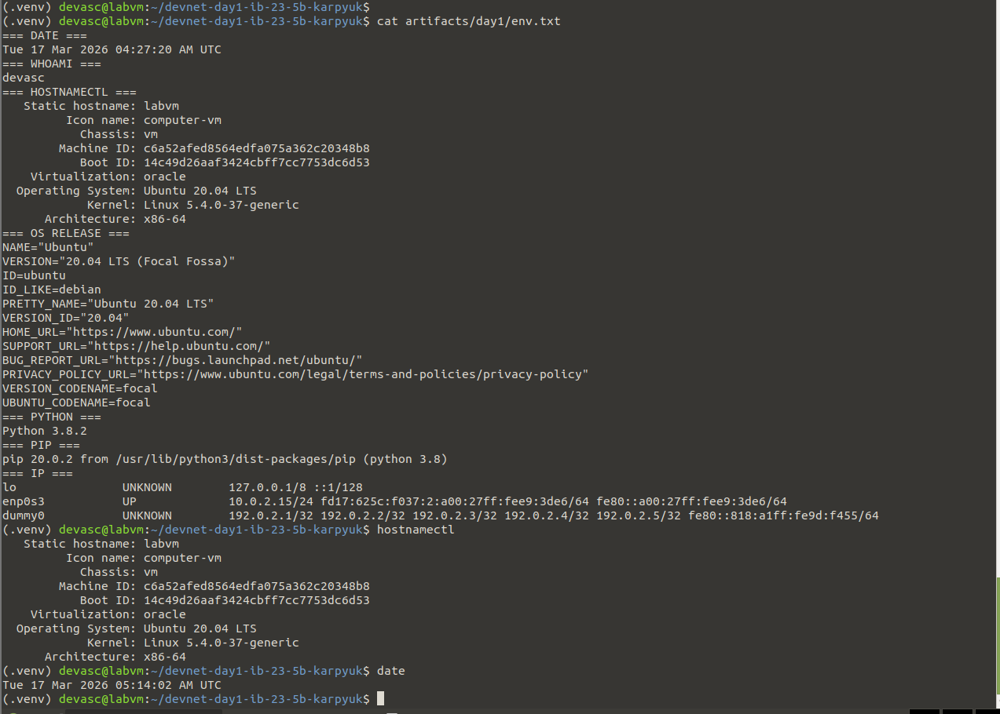
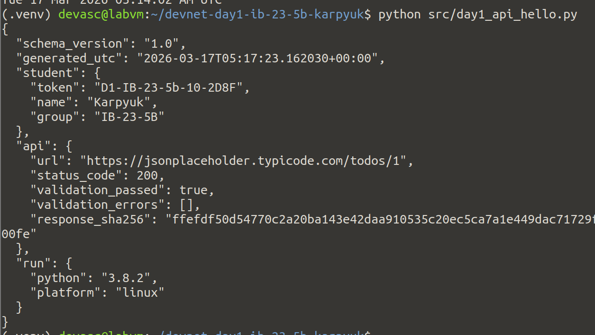
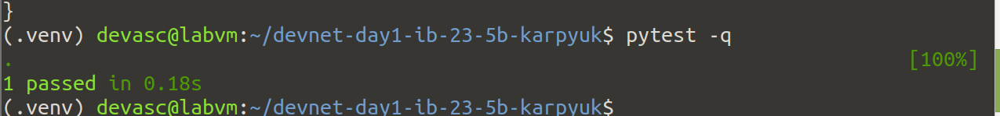
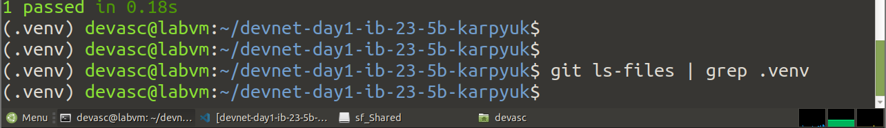

# Day 1 Report — DevNet Sprint

## 1. Student
- Name: [Карпюк Дмитрий]
- Group: [Иб-23-5б]
- GitHub repo: [https://github.com/DmitryKarp4/devnet_sprint_lab]
- Day1 Token: [D1-IB-23-5b-10-2D8F]

## 2. NetAcad progress (Module 1)
- Completed items: [1.1 / 1.2 / 1.3] (кратко)
- Screenshot(s): 
  - 
  - 
  - 

## 3. VM evidence
- File: `artifacts/day1/env.txt` exists: [**Yes**/No]
- Screenshot(s):
  - 

## 4. Repo structure (must match assignment)
- `src/day1_api_hello.py` : [**Yes**/No]
- `tests/test_day1_api_hello.py` : [**Yes**/No]
- `schemas/day1_summary.schema.json` : [**Yes**/No]
- `artifacts/day1/summary.json` : [**Yes**/No]
- `artifacts/day1/response.json` : [**Yes**/No]

## 5. Commands run (paste EXACT output)
### 5.1 Script run

### 5.2 Tests

## 6. Что я изучил сегодня (3–6 bullets)
* Научился обращаться к API с помощью библиотеки `requests` в Python.
* Научился создавать и использовать JSON-схемы для валидации данных.
* Закрепил использование юнит-тестов с помощью `pytest` для проверки корректности работы API. 

## 7. Проблемы и решения (как минимум 1)

### TypeError
- **Problem**: При запуске скрипта на версиях Python ниже 3.9 возникает ошибка TypeError: 'type' object is not subscriptable. Это происходит из-за использования встроенных типов (dict, list, tuple) с квадратными скобками для аннотаций (например, list[str]), что не поддерживалось в старых интерпретаторах.
- **Fix**: Был добавлен импорт from __future__ import annotations, который активирует отложенную оценку аннотаций (они трактуются как строки). Также исправлены некорректные типы Dict, Tuple, Bool на стандартные dict, tuple, bool для единообразия.
- **Proof (file/screenshot/command)**:
  python3 src/day1_api_hello.py  # Запускается без TypeError

### Удаление секретов и мусора из истории Git
**Problem:** В репозиторий по ошибке была закоммичена папка виртуального окружения .venv. Это привело к избыточному размеру репозитория и потенциальным конфликтам путей, так как папка попала во все предыдущие коммиты.
**Fix:** Использована команда git filter-repo для полной перезаписи истории и удаления пути .venv/ из всех существующих слепков (snapshots) проекта. Исправлен .gitignore для предотвращения повторного добавления.
**Proof (file/screenshot/command):**
- Результат команды git ls-files, показывающий отсутствие .venv в истории